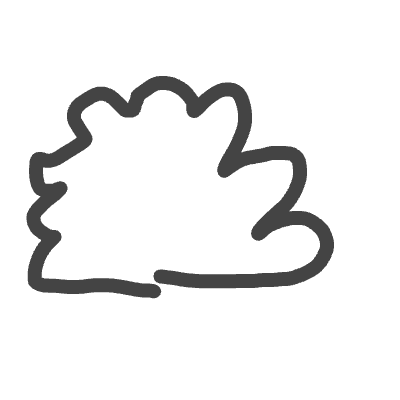
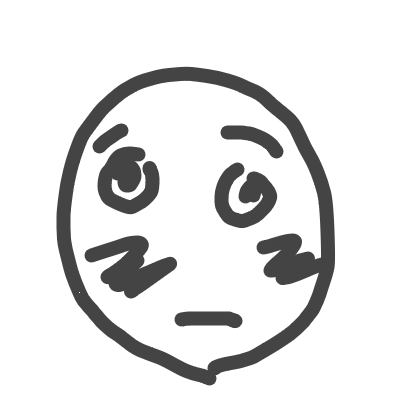
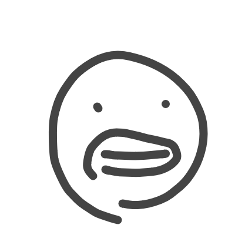

# Emoji drawings dataset 

This dataset features **4,945** grayscaled human-made drawings of emojis.  
Each image is ARGB PNG 400x400.  


## Instructions
All the dataset is located in the `images` directory.  

The labels of each emoji image is embedded in the file name, formatted like:
```
[emoji-index]_[creator]_[time].png
```

`[emoji-index]` - The index of the emoji from the table below. (0-17)  
`[creator]` - The person who drew the image.  
`[time]` - Time of being drawn. Milliseconds since the Epoch.  

#### For example:
```
0-shalev-1705925374511.png
```
`0` - Emoji index 0: 😁  
`shalev` - Created by "shalev"  
`1705925374511` - Was drawn on GMT Monday, January 22, 2024 12:09:34.511 PM  

## Using with Tensorflow Datasets
### Locally
Copy the Python file `emoji_drawings_tfds_builder.py` to your project's directory and add 
```py
import emoji_drawings_tfds_builder
```
to your Python file.

### In colab
Copy the contents of the file `emoji_drawings_tfds_builder.py` into a code block and run it.

### Usage
Then you'll be able to use Emoji Drawings as a tfds dataset:
```py
(ds_train, ds_valid, ds_test), ds_info = tfds.load(
    'emoji_dataset',
    split = ["train[:80%]", "train[80%:90%]", "train[90%:]"],
    shuffle_files=True,
    as_supervised=True,
    with_info=True
)
```

###### [More info for how to load custom tfds datasets](https://www.tensorflow.org/datasets/add_dataset#tldr)


## Emojis

| Index         | Emoji         | Name          | Example       |
| ------------- | ------------- | ------------- | ------------- |
| 0  | 😁 | beaming-face | <p align="center"></p>
| 1  | ☁️ | cloud | <p align="center"></p>
| 2  | 😵‍💫 | face-spiral | <p align="center"></p> 
| 3  | 😳 | flushed-face | <p align="center"></p>
| 4  | 😬 | grimacing-face | <p align="center"></p>
| 5  | 😃 | grinning-face | <p align="center"></p>
| 6  | 😆 | grinning-squinting | <p align="center"></p>
| 7  | ❤️ | heart | <p align="center"></p>
| 8  | 😡 | pouting-face | <p align="center"></p>
| 9  | 🤨 | raised-eyebrow | <p align="center"></p>
| 10 | 🤨 | relieved-face | <p align="center"></p>
| 11 | 😋 | savoring-food | <p align="center"></p>
| 12 | 😍 | smiling-heart | <p align="center"></p>
| 13 | 😈 | smiling-horns | <p align="center"></p>
| 14 | 😎 | smiling-sunglasses | <p align="center"></p>
| 15 | 🥲 | smiling-tear | <p align="center"></p>
| 16 | 😏 | smirking-face | <p align="center"></p>
| 17 | 😂 | tears-of-joy | <p align="center"></p>

# Credits:
| Emojis drawn | Name |
| ------------|------|
| 2064 | shalev |
| 817 | wakatta |
| 707 | Ido |
| 170 | Gil |
| 166 | kashkash |
| 153 | Biton |
| 150 | Hello |
| 77 | Name |
| 75 | Zohar |
| 69 | superyehezkel |
| 64 | Asaflevi |
| 60 | Brkzr |
| 33 | Dvir |
| 29 | Smadi |
| 28 | Nir |
| 23 | Bruh |
| 20 | S_x |
| 16 | Guy |
| 16 | deeznats |
| 15 | Yonatan |
| 15 | Ruth |
| 15 | Lulu |
| 14 | bigwolman |
| 10 | Liel |
| 10 | Adir |
| 8 | ThickNi__a |
| 8 | Liran |
| 8 | Alon |
| 7 | s_x |
| 7 | Asaflotz |
| 7 | Ariel |
| 6 | Whfkykgkg |
| 6 | Tyb |
| 6 | Omer |
| 5 | Yosi |
| 5 | UriMishkin |
| 5 | Ofir |
| 5 | Ofek |
| 4 | shani |
| 4 | Poopoolol |
| 4 | Itay |
| 4 | Hadar |
| 4 | Eyal |
| 3 | roprop |
| 3 | Ori |
| 3 | Dydya |
| 3 | amit |
| 2 | Yael |
| 2 | hdhdbdb |
| 2 | avivHamagniv |
| 2 | Argh |
| 2 | Arbel |
| 1 | yuval |
| 1 | sjjsjs |
| 1 | Biton2 |
